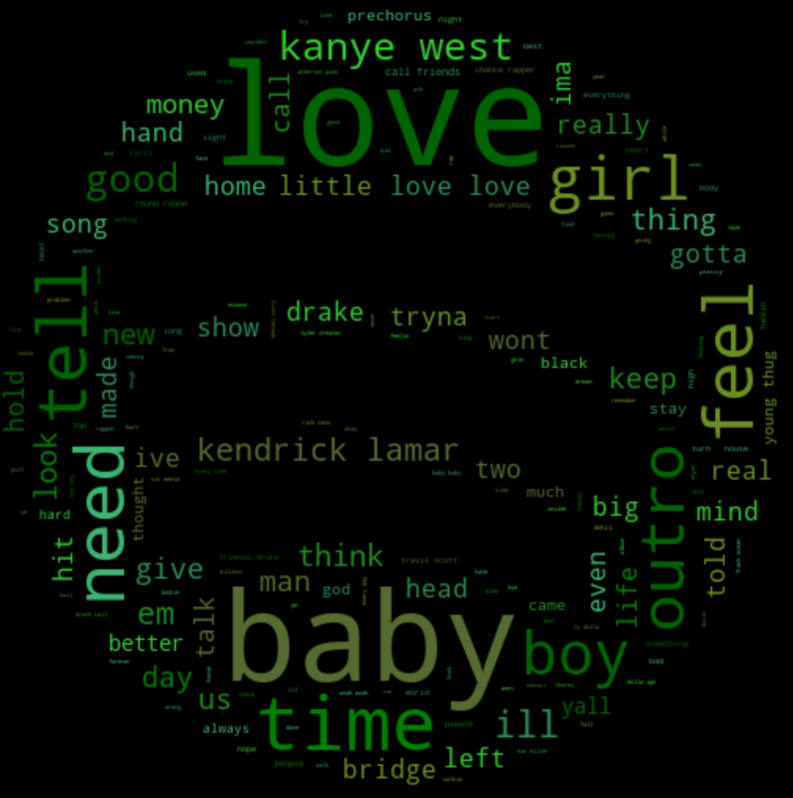
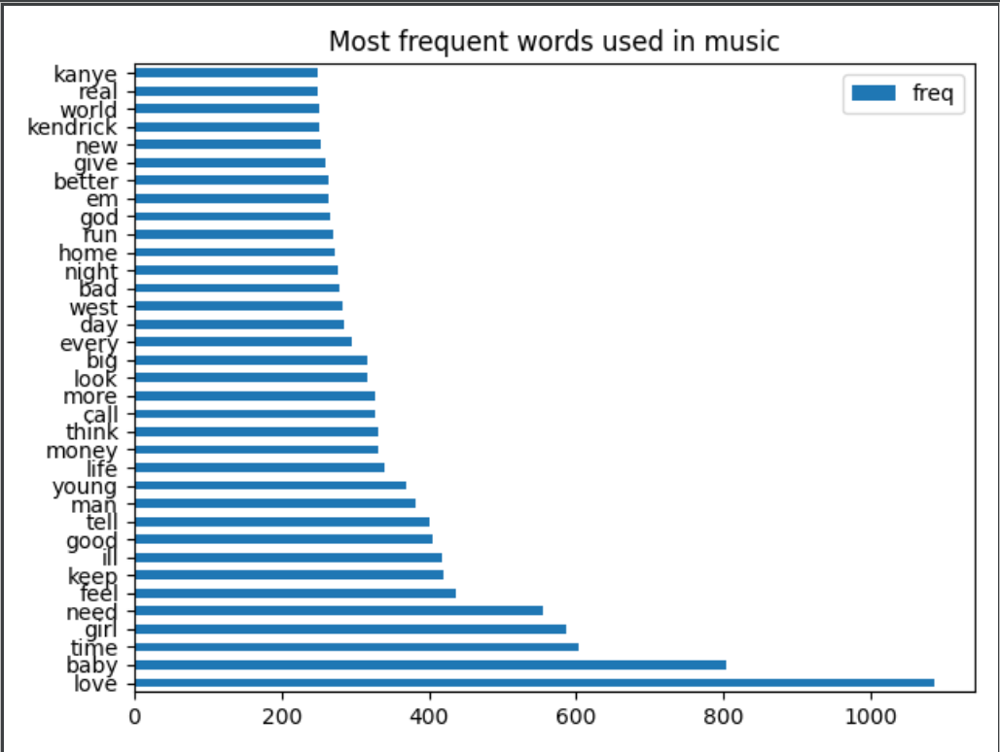

<h1 align="center">melodia 🎶</h1> 
<p align="center"><strong>analyze the lyrics of songs you love!</strong></p>
 <p align="center"> a python application that analyzes the lyrics in your top spotify songs and playlists. created with spotify, lyric genius, and paralleldots apis.
<p align="center">
  <sub>built with ❤︎ by
  <a href="https://twitter.com/nishpant">Nisha Pant</a>. README design inspired by <a href="https://github.com/choojs/choo#readme">choo</a>.</p>
</p>

## Features
- __spotify integration:__ retrieve music data directly from your spotify
- __word clouds:__ build a cool word cloud from the lyrics of your music
- __emotion analysis:__ analyze the overwhelming emotion from a spotify playlist or your top 50 spotify songs
- __frequency statistics:__ view data on the most frequent words used in specific songs or playlists

## Motivation

## Setup
- __install python and libraries:__ make sure you have <a href="https://www.python.org/downloads/">python3</a> installed on your computer <br />
install these libraries using pip (i would also recommend setting up a virtual envrionment): </br>
  ```
    >> pip install spotipy
    >> pip install lyricgenius
    >> pip install paralleldots
    >> pip install wordcloud
  ```
- __create api accounts:__ create an account for spotify, lyric genius, and paralleldots and copy api keys, client ids, and redirect uris into the project
- __add api keys:__ copy api keys, client ids, and redirect uris into the project
- __run:__ run index.py and you are all set!

## Findings
<p align="center">
   
</p>
<p align="center">
  
</p>
