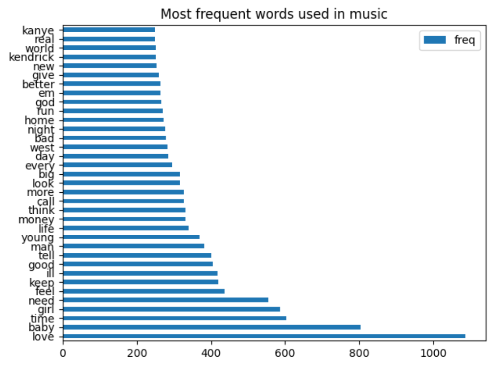
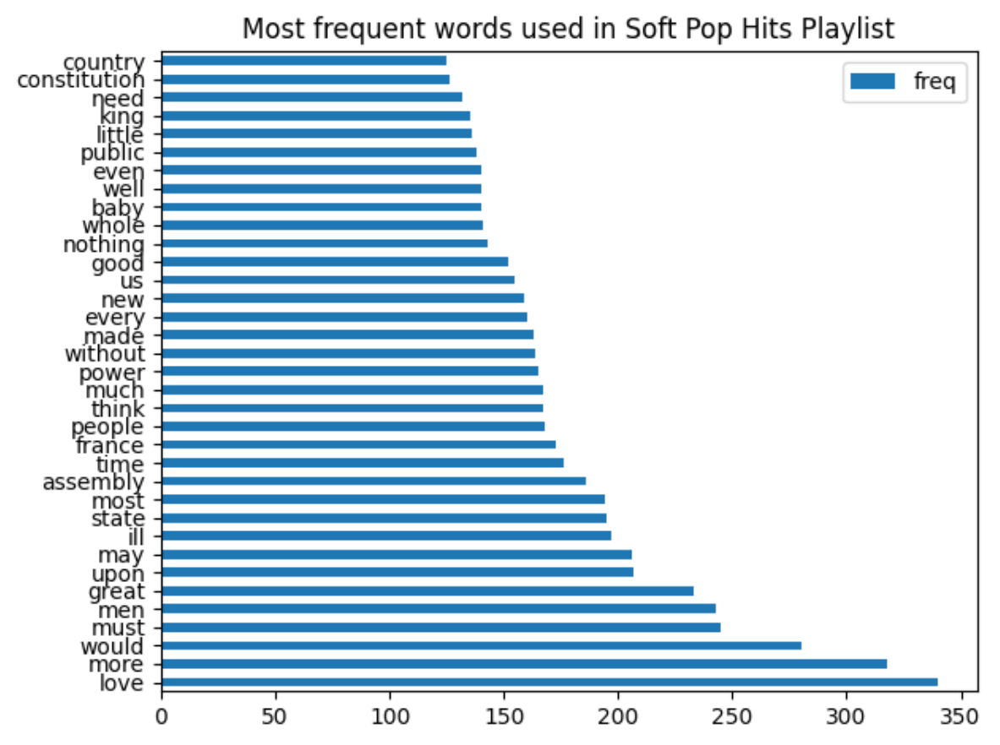

<h1 align="center">melodia 🎶</h1> 
<p align="center"><strong>analyze the lyrics of songs you love!</strong></p>
 <p align="center"> a python application that analyzes the lyrics in your top spotify songs and playlists. created with spotify, lyric genius, and paralleldots apis.
<p align="center">
  <sub>built with ❤︎ by
  <a href="https://twitter.com/nishpant">Nisha Pant</a>. README design inspired by <a href="https://github.com/choojs/choo#readme">choo</a>.</p>
</p>

## Features
- __spotify integration:__ retrieve music data directly from your spotify
- __word clouds:__ build a cool word cloud from the lyrics of your music
- __emotion analysis:__ analyze the overwhelming emotion from a spotify playlist or your top 50 spotify songs
- __frequency statistics:__ view data on the most frequent words used in specific songs or playlists

## Setup
- __install python and libraries:__ make sure you have <a href="https://www.python.org/downloads/">python3</a> installed on your computer <br />
install these libraries using pip (i would also recommend setting up a virtual envrionment): </br>
  ```
    >> pip install spotipy
    >> pip install lyricgenius
    >> pip install paralleldots
    >> pip install wordcloud
  ```
- __create api accounts:__ create an account for spotify, lyric genius, and paralleldots and copy api keys, client ids, and redirect uris into the project
- __add api keys:__ copy api keys, client ids, and redirect uris into the project
- __run:__ run index.py and you are all set!

## Findings
after cleaning up the data* returned from the lyrics from over 250 songs (mainly rap and r&b) from my spotify library, i came up with this bar graph with the most frequent words used in the songs. 
<p align="center">
  
</p>
<p>
"love" was by far the most frequent word used in the songs i analyzed with "baby" close behind, as many rappers discuss love and relationships in their music. below is a more fun way to view the same information in a word cloud, enjoy :)
</p>
<p align="center">
   
</p>

i created simliar graphs with more controlled data using featured spotify playlists. analyzing the data from the "Rap Caviar" playlist and the "Soft Pop Hits" playlist, it seems that "love" is a common topic amongst these two genres. in contrast, the rap playlist had common words such as "rags", "riches", and "money" whereas the soft pop playlist used words like "state", "power", and "constitution".
<p align="center">
    
    
</p>

<p align="center">
    
  
</p>

additionally, the overall emotions of the playlists hugely differed. the rap caviar playlist seemed to have a fear overtone, whereas the soft pop hits playlist were more happy. 

<p align="center">
    
    
</p>

\* cleaning data included removing stop words, special characters, profanity, and contractions
